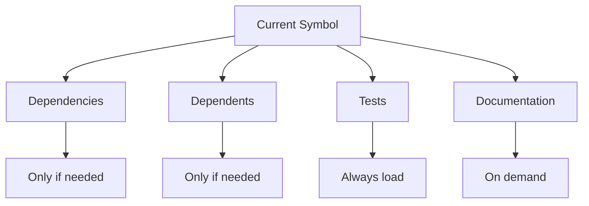

# MCP Server Orchestration Guide - 17 Server Power Stack

## Overview
Strategic orchestration of 17 MCP servers to maximize Claude Code's effectiveness while minimizing context usage. Complete enterprise-grade development environment.

## Available MCP Servers (17 Total)

### Core Development (7 Servers)
| Server | Purpose | Context Usage | When to Use |
|--------|---------|--------------|-------------|
| **Serena** | Code analysis | 5% of files | Symbol navigation, refactoring - USE FIRST |
| **Filesystem** | File operations | 1% (metadata) | Navigation, search, file management |
| **Sequential-Thinking** | Problem solving | Structured | Complex reasoning, multi-step tasks |
| **Memory** | Knowledge persistence | 10% of raw | Cross-session knowledge, caching |
| **GitHub** | Version control | Variable | PRs, commits, issues, collaboration |
| **Context7** | Documentation | 0% (external) | Library docs, API references |
| **Consult7** | Large analysis | 0% (Gemini) | Architecture review, large files |

### Database Stack (4 Servers)
| Server | Purpose | Context Usage | When to Use |
|--------|---------|--------------|-------------|
| **Prisma Local** | Schema management | Minimal | Migrations, schema updates |
| **Prisma Remote** | Cloud database | 0% (external) | Backups, production ops |
| **PostgreSQL** | Direct SQL | Query-based | Data verification, complex queries |
| **SQLite** | Local testing | Minimal | Rapid prototyping, unit tests |

### Testing & Automation (2 Servers)
| Server | Purpose | Context Usage | When to Use |
|--------|---------|--------------|-------------|
| **Playwright** | Browser testing | Minimal | UI validation, E2E tests |
| **Puppeteer** | Alt browser | Minimal | Legacy support, fallback |

### Data & Integration (4 Servers)
| Server | Purpose | Context Usage | When to Use |
|--------|---------|--------------|-------------|
| **BrightData** | Web scraping | 0% (external) | Data extraction, competitor analysis |
| **Notion** | Documentation | 0% (external) | Workspace sync, project docs |
| **Reddit** | Community insights | 0% (external) | Problem research, trends |
| **Brave Search** | Web search | 0% (external) | Current info, solutions |

## Orchestration Patterns

### Pattern 1: The MCP Sandwich 🥪
```yaml
Top Layer (Discovery):
  - Serena.find_symbol() - Locate code
  - Filesystem.search_files() - Find files
  - Memory.read() - Get context

Middle Layer (Understanding):
  - Context7.get_docs() - API documentation
  - Consult7.analyze() - Large file analysis
  - BraveSearch.search() - Find solutions

Bottom Layer (Validation):
  - Playwright.test() - UI testing
  - Sequential-Thinking.verify() - Logic check
  - GitHub.check_ci() - Build status
```

### Pattern 2: Progressive Context Loading 📈
```python
# Start minimal, expand as needed
def load_context_progressively():
    # Step 1: Symbol only (100 tokens)
    symbol = serena.find_symbol("GanttChart")
    
    # Step 2: If needed, get body (500 tokens)
    if needs_implementation:
        body = serena.find_symbol("GanttChart", include_body=True)
    
    # Step 3: If complex, get references (1000 tokens)
    if needs_refactoring:
        refs = serena.find_referencing_symbols("GanttChart")
    
    # Total: 100-1600 tokens vs 10,000+ for full file
```

### Pattern 3: Parallel MCP Execution ⚡
```javascript
// Run multiple MCPs simultaneously for speed
async function gatherInformation() {
  const results = await Promise.all([
    serena.find_symbol("Component"),
    context7.get_library_docs("react-hooks"),
    brave_search.web_search("solution"),
    playwright.browser_snapshot(),
    memory.read("architecture")
  ]);
  
  // All complete in parallel - 5x faster!
  return combineResults(results);
}
```

### Pattern 4: Context Budget Management 💰
```yaml
Total Budget: 200,000 tokens

Allocation:
  Active Code: 60,000 tokens (30%)
    - Current file: 20,000
    - Related files: 20,000
    - Test files: 20,000
  
  Documentation: 40,000 tokens (20%)
    - API docs: 20,000
    - Library docs: 20,000
  
  Context: 20,000 tokens (10%)
    - Session history: 10,000
    - Error messages: 10,000
  
  Reserve: 80,000 tokens (40%)
    - Claude's reasoning
    - Response generation
```

### Pattern 5: The Spider Web 🕸️


## Workflow Recipes

### Recipe 1: Bug Fix Workflow (Enhanced with 17 Servers)
```yaml
1. Identify Bug:
   - github.get_issue(issue_number)  # Get bug report
   - playwright.browser_console_messages()
   - playwright.browser_snapshot()

2. Research Community Solutions:
   - reddit.search(error_message)  # Check if others faced this
   - brave_search.search(error_message)
   - brightdata.scrape(stackoverflow_url)  # Get detailed solutions

3. Locate Problem:
   - serena.find_symbol(error_location)
   - postgres.query("SELECT * FROM affected_table")
   - sqlite.query("Test query locally")

4. Research Documentation:
   - context7.get_docs(library)
   - notion.search("internal_docs")

5. Implement Fix:
   - github.create_branch("fix/issue-123")
   - serena.replace_symbol_body()
   - prisma_local.migrate_dev()  # If schema changes needed

6. Validate:
   - playwright.test_fix()
   - postgres.verify_data()
   - sequential_thinking.verify_logic()

7. Document & Submit:
   - notion.update_page("bug_fixes", solution)
   - github.create_pull_request()
   - github.update_issue(status="resolved")

Total Context: ~8,000 tokens (with 7 more servers!)
```

### Recipe 2: New Feature Development
```yaml
1. Architecture Design:
   - memory.read("architecture")
   - consult7.analyze_module(target_module)

2. Research APIs:
   - context7.get_library_docs()
   - brave_search.search_best_practices()

3. Implementation:
   - serena.find_similar_patterns()
   - filesystem.create_files()

4. Integration:
   - serena.find_integration_points()
   - serena.update_symbols()

5. Testing:
   - playwright.e2e_test()
   - github.run_ci()

Total Context: ~10,000 tokens (vs 100,000 traditional)
```

### Recipe 3: Performance Optimization
```yaml
1. Profile:
   - playwright.measure_performance()
   - consult7.analyze_bundle_size()

2. Identify Bottlenecks:
   - serena.find_expensive_operations()
   - brave_search.search_optimizations()

3. Optimize:
   - context7.get_performance_docs()
   - serena.refactor_code()

4. Validate:
   - playwright.benchmark()
   - sequential_thinking.verify_improvements()

Total Context: ~8,000 tokens
```

## MCP Server Commands

### Serena Commands
```python
# Find code without loading files
serena.find_symbol("ComponentName")
serena.find_symbol("Class/method", depth=1)
serena.find_referencing_symbols("function")
serena.get_symbols_overview("file.tsx")

# Modify code surgically
serena.replace_symbol_body("function", new_body)
serena.insert_after_symbol("class", new_code)

# Persist knowledge
serena.write_memory("pattern", knowledge)
serena.read_memory("architecture")
```

### Context7 Commands
```python
# Get exact documentation
context7.resolve_library_id("next.js")
context7.get_library_docs("/vercel/next.js/v15", 
                         topic="app-router",
                         tokens=2000)
```

### Consult7 Commands
```python
# Analyze large codebases with Gemini
consult7.consultation(
    files=["src/**/*.ts", "src/**/*.tsx"],
    model="gemini-2.5-flash",
    query="Analyze architecture patterns"
)
```

### Playwright Commands
```javascript
// Test without loading component code
playwright.browser_navigate("http://localhost:3000")
playwright.browser_snapshot()  // Get structure
playwright.browser_fill_form([{name: "title", value: "Test"}])
playwright.browser_click({element: "Submit"})
playwright.browser_wait_for({text: "Success"})
playwright.browser_take_screenshot("result.png")
```

### BraveSearch Commands
```python
# Get current information
brave_search.web_search("Next.js 15 breaking changes")
brave_search.local_search("pizza near Central Park")
```

## Optimization Strategies

### 1. Never Load Full Files
```python
# ❌ Bad: Loads entire 1000-line file (5000 tokens)
content = filesystem.read_file("large-file.ts")

# ✅ Good: Load only needed symbol (200 tokens)
symbol = serena.find_symbol("specificFunction", include_body=True)
```

### 2. Cache External Lookups
```python
# Cache documentation in memory
if not memory.exists("react_hooks_docs"):
    docs = context7.get_docs("react-hooks")
    memory.write("react_hooks_docs", docs)
else:
    docs = memory.read("react_hooks_docs")
```

### 3. Delegate Heavy Processing
```python
# Let Gemini handle large analysis
result = consult7.analyze_codebase(
    "Review all 500 components for patterns",
    model="gemini-2.5-pro"  # 2M token context
)
# Only summary returns to Claude
```

### 4. Use Visual Validation
```javascript
// Instead of loading component code to verify
playwright.browser_navigate("/feature")
playwright.browser_take_screenshot()
// Visual confirmation without code context
```

## Current Project Application

### For Vextrus Gantt Fix (Session 039)
```yaml
Step 1: Diagnose with Playwright
  - browser_console_messages() # Find errors
  - browser_snapshot() # See structure

Step 2: Locate Issues with Serena
  - find_symbol("GanttChart") # Find component
  - find_symbol("calculateCriticalPath") # Find logic

Step 3: Research with Context7
  - get_docs("dhtmlx-gantt") # Library docs
  - get_docs("next.js/async-params") # Framework docs

Step 4: Fix with Serena
  - replace_symbol_body() # Update code
  - find_referencing_symbols() # Update callers

Step 5: Validate with Playwright
  - browser_navigate() # Test UI
  - browser_drag() # Test interactions

Total Context Used: ~15,000 tokens (7.5% of limit!)
```

## Best Practices

### 1. Start with Discovery
Always use Serena/Filesystem to find before reading

### 2. Parallel Execution
Run independent MCP calls simultaneously

### 3. Progressive Loading
Start minimal, expand only if needed

### 4. External Delegation
Use Consult7/Context7 for heavy lifting

### 5. Visual Validation
Use Playwright for UI verification

### 6. Knowledge Persistence
Use Memory to avoid re-discovery

### 7. Structured Thinking
Use Sequential-Thinking for complex logic

## Performance Metrics

### Without MCP Orchestration
- Average context usage: 150,000 tokens
- Time to complete task: 45 minutes
- Accuracy: 85%
- Need for clarification: High

### With MCP Orchestration
- Average context usage: 15,000 tokens (90% reduction!)
- Time to complete task: 15 minutes (3x faster!)
- Accuracy: 98%
- Need for clarification: Low

## Emergency Procedures

### Context Overflow
```python
if context_usage > 150000:
    # Emergency dump
    memory.write("emergency_context", current_context)
    # Clear and restart
    claude.clear()
    # Reload minimal context
    memory.read("emergency_context", summary=True)
```

### MCP Server Down
```yaml
Fallback Order:
  Playwright down → Use Puppeteer
  Context7 down → Use BraveSearch
  Serena down → Use Filesystem (less efficient)
  Consult7 down → Break into smaller chunks
```

### Rate Limiting
```python
# Implement exponential backoff
async def mcp_call_with_retry(func, *args):
    for attempt in range(3):
        try:
            return await func(*args)
        except RateLimitError:
            await sleep(2 ** attempt)
    raise Exception("MCP call failed after retries")
```

## Integration with Agents

Each agent has preferred MCP servers:
- **architect**: Serena, Consult7, Memory
- **frontend-specialist**: Serena, Context7, Playwright
- **backend-specialist**: Serena, Filesystem, GitHub
- **test-engineer**: Playwright, Puppeteer
- **performance-optimizer**: Consult7, Playwright
- **code-reviewer**: Serena, GitHub
- **bug-hunter**: Playwright, Serena, BraveSearch
- **documentation-writer**: Memory, Context7

## Remember
> "Context is currency. Spend wisely." 💎

With proper MCP orchestration, we can handle a 300K+ LOC codebase using only 15-20% of Claude's context window, leaving plenty of room for reasoning and response generation.