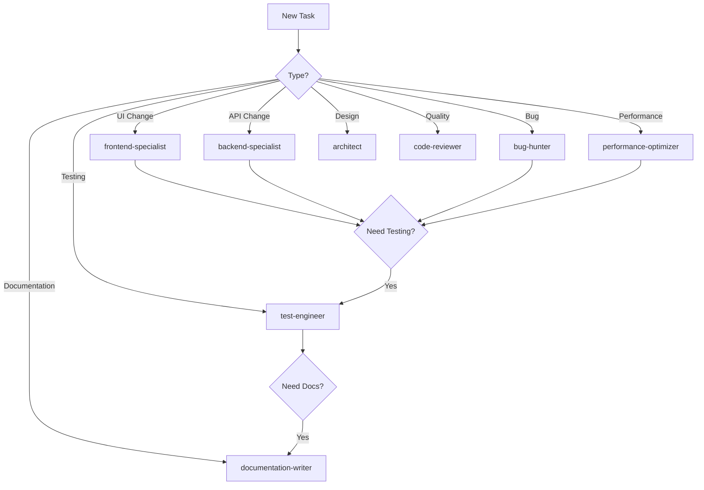

# Agent Router - Orchestration System

## Purpose
This router orchestrates task delegation to specialized agents based on the nature of the work, ensuring the right expertise is applied to each problem.

## Agent Specializations

| Agent | Primary Domain | Trigger Keywords |
|-------|---------------|------------------|
| **architect** | System design, architecture | design, architecture, pattern, structure, scalability |
| **frontend-specialist** | UI/UX, React, Next.js | component, ui, render, frontend, react, style |
| **backend-specialist** | APIs, database, server | api, database, prisma, endpoint, query, cache |
| **test-engineer** | Testing, quality assurance | test, playwright, jest, e2e, coverage, quality |
| **performance-optimizer** | Speed, optimization | performance, slow, optimize, speed, memory, bundle |
| **code-reviewer** | Code quality, standards | review, quality, refactor, clean, standard |
| **bug-hunter** | Debugging, fixes | bug, error, broken, fix, debug, issue |
| **documentation-writer** | Documentation, guides | document, guide, readme, explain, write |

## Routing Rules

### 1. Task Analysis
```yaml
When receiving a task:
  1. Identify primary domain
  2. Check for cross-cutting concerns
  3. Determine if multiple agents needed
  4. Route to appropriate specialist(s)
```

### 2. Multi-Agent Collaboration
```yaml
Complex Tasks:
  - Architecture + Implementation:
    → architect (design) → specialist (implement) → test-engineer (verify)
  
  - Bug Fix:
    → bug-hunter (diagnose) → specialist (fix) → test-engineer (verify)
  
  - Performance Issue:
    → performance-optimizer (analyze) → specialist (implement) → test-engineer (verify)
  
  - New Feature:
    → architect (design) → frontend/backend (implement) → test-engineer (test) → documentation-writer (document)
```

### 3. Decision Tree


## Task Routing Examples

### Example 1: "Fix the Gantt chart not showing tasks"
```yaml
Analysis:
  - Primary: Bug fix (UI component)
  - Domain: Frontend
  - Type: Debugging + Implementation

Routing:
  1. bug-hunter - Diagnose why tasks aren't showing
  2. frontend-specialist - Implement the fix
  3. test-engineer - Verify with Playwright
  4. documentation-writer - Update troubleshooting guide
```

### Example 2: "Optimize API response times"
```yaml
Analysis:
  - Primary: Performance optimization
  - Domain: Backend
  - Type: Analysis + Optimization

Routing:
  1. performance-optimizer - Profile and identify bottlenecks
  2. backend-specialist - Implement optimizations
  3. test-engineer - Benchmark improvements
  4. documentation-writer - Document optimization techniques
```

### Example 3: "Add new financial module"
```yaml
Analysis:
  - Primary: New feature development
  - Domain: Full-stack
  - Type: Architecture + Implementation

Routing:
  1. architect - Design module structure
  2. backend-specialist - Create database schema and APIs
  3. frontend-specialist - Build UI components
  4. test-engineer - Create comprehensive tests
  5. code-reviewer - Review implementation
  6. documentation-writer - Create user guide
```

## Communication Protocol

### Agent Handoff
```typescript
interface AgentHandoff {
  from: Agent;
  to: Agent;
  task: {
    id: string;
    description: string;
    context: any;
    artifacts: string[];
  };
  status: 'pending' | 'in-progress' | 'completed' | 'blocked';
  notes: string;
}
```

### Status Updates
```yaml
Each agent must:
  - Report when starting a task
  - Provide progress updates
  - Document blockers immediately
  - Share artifacts upon completion
  - Request help when needed
```

## Escalation Protocol

### When to Escalate
1. **Blocked by external dependency**
   → Escalate to architect
   
2. **Performance degradation detected**
   → Alert performance-optimizer immediately
   
3. **Security vulnerability found**
   → Stop all work, alert architect and backend-specialist
   
4. **Breaking change required**
   → Get architect approval before proceeding
   
5. **User experience impacted**
   → Involve frontend-specialist and test-engineer

## Quality Gates

### Before Task Completion
```yaml
Required Checks:
  ✓ Code reviewed (code-reviewer)
  ✓ Tests passing (test-engineer)
  ✓ Performance validated (performance-optimizer)
  ✓ Documentation updated (documentation-writer)
  ✓ No new bugs introduced (bug-hunter)
```

## Current Priorities

### Immediate (Session 039)
1. **Fix Gantt Chart** 
   - bug-hunter → frontend-specialist → test-engineer
   
2. **Update API Routes for Next.js 15**
   - backend-specialist → test-engineer
   
3. **Enable Critical Path**
   - backend-specialist → frontend-specialist → test-engineer

### Next Phase
1. Complete Project Module
2. Start Financial Module
3. Optimize Performance
4. Improve Documentation

## Metrics & Monitoring

### Agent Performance
```yaml
Track per agent:
  - Tasks completed
  - Average time per task
  - Success rate
  - Rework required
  - Collaboration effectiveness
```

### System Health
```yaml
Monitor:
  - Total tasks in queue
  - Average completion time
  - Blocker frequency
  - Quality gate pass rate
  - Documentation coverage
```

## Best Practices

1. **Always verify agent selection**
   - Is this the right specialist?
   - Do we need multiple agents?
   
2. **Provide complete context**
   - Share relevant files
   - Include error messages
   - Provide reproduction steps
   
3. **Set clear expectations**
   - Define success criteria
   - Set time constraints
   - Specify quality requirements
   
4. **Enable collaboration**
   - Facilitate agent communication
   - Share discoveries
   - Document lessons learned
   
5. **Maintain quality**
   - Never skip quality gates
   - Always test before marking complete
   - Document everything

## Agent Activation Commands

When you need a specific agent:
- `@architect` - System design questions
- `@frontend-specialist` - UI/React issues
- `@backend-specialist` - API/Database tasks
- `@test-engineer` - Testing requirements
- `@performance-optimizer` - Speed improvements
- `@code-reviewer` - Code quality checks
- `@bug-hunter` - Debug problems
- `@documentation-writer` - Documentation needs