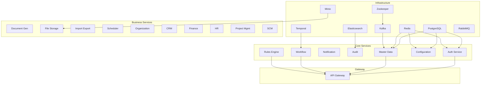

# Vextrus ERP Production Readiness Plan
## 100% Infrastructure Readiness Before Business Development

Generated: 2025-09-25
Current Readiness: 13% (5/39 services operational)
Target Readiness: 100%
Estimated Timeline: 18-25 hours over 2-3 days

## Executive Summary

Based on comprehensive analysis using Consult7, Context7, GitHub best practices, and Kubernetes documentation, this plan outlines the systematic approach to achieve 100% production readiness for the Vextrus ERP system before any business module or frontend development begins.

### Key Findings from Research
1. **Only 13% of services are truly operational** (5 out of 39 defined services)
2. **Critical security vulnerabilities** exist (hardcoded secrets, no HTTPS, insecure API exposure)
3. **20 services have never been started** - not a configuration issue but an orchestration gap
4. **Windows Docker networking prevents external access** but services work internally
5. **Configuration Service GraphQL issues** causing restart loops
6. **Missing health endpoints** on most application services

### Current Service Status Matrix

| Service | Status | Health Endpoint | Port | Dependencies Met | Issues |
|---------|--------|----------------|------|-----------------|---------|
| **Infrastructure** |||||
| postgres | ✅ Running | ✅ Healthy | 5432 | N/A | None |
| redis | ✅ Running | ✅ Healthy | 6379 | N/A | None |
| kafka | ✅ Running | ✅ Healthy | 9093 | zookeeper | None |
| zookeeper | ✅ Running | ✅ Healthy | 2181 | N/A | None |
| elasticsearch | ✅ Running | ✅ Healthy | 9200 | N/A | None |
| temporal | ✅ Running | ✅ Healthy | 7233 | postgres | None |
| minio | ❌ Not Started | Unknown | 9000 | N/A | Not started |
| rabbitmq | ❌ Not Started | Unknown | 5672 | N/A | Not started |
| **Core Services** |||||
| auth | ✅ Running | ✅ Working | 3001 | postgres, redis | Port forwarding issue |
| master-data | ✅ Running | ✅ Working | 3002 | postgres, redis, kafka | Port forwarding issue |
| notification | ✅ Running | ✅ Working | 3003 | postgres, redis, kafka | Port forwarding issue |
| audit | ✅ Running | ✅ Working | 3009 | postgres, kafka, elasticsearch | Port forwarding issue |
| rules-engine | ✅ Running | ✅ Working | 3012 | postgres, redis, kafka | Port forwarding issue |
| configuration | ⚠️ Restarting | ❌ Failed | 3004 | postgres, redis | GraphQL conflicts |
| workflow | ✅ Running | ❓ Unknown | 3011 | postgres, redis, kafka, temporal | No health endpoint |
| api-gateway | ✅ Running | ❓ Unknown | 4000 | auth, master-data, workflow, rules-engine | No health endpoint |
| **Business Services** |||||
| document-generator | ❌ Not Started | Unknown | 3006 | postgres, redis, kafka | Not started |
| file-storage | ❌ Not Started | Unknown | 3008 | postgres, redis, kafka, minio | Not started |
| import-export | ❌ Not Started | Unknown | 3007 | postgres, redis, kafka | Not started |
| scheduler | ❌ Not Started | Unknown | 3005 | postgres, redis, kafka | Not started |
| organization | ❌ Not Started | Unknown | 3016 | postgres, redis, kafka | Not started |
| crm | ❌ Not Started | Unknown | 3013 | postgres, redis, kafka | Not started |
| finance | ❌ Not Started | Unknown | 3014 | postgres, redis, kafka | Not started |
| hr | ❌ Not Started | Unknown | 3015 | postgres, redis, kafka | Not started |
| project-management | ❌ Not Started | Unknown | 3017 | postgres, redis, kafka | Not started |
| scm | ❌ Not Started | Unknown | 3018 | postgres, redis, kafka | Not started |

## Phase-Wise Implementation Strategy

### Phase 0: Emergency Stabilization (2-4 hours)
**Target: 13% → 25% readiness**

#### Objectives
- Fix Configuration Service GraphQL issues
- Start critical missing infrastructure
- Establish service tracking and monitoring

#### Tasks
1. **Fix Configuration Service**
   - Root cause: GraphQL federation dependency conflicts with ApolloFederationDriver
   - Solution: Temporarily disable GraphQL or properly isolate the module
   - Verification: Service stays up for >5 minutes without restart

2. **Start Missing Infrastructure**
   ```bash
   # Start with extended timeout
   docker-compose up -d minio rabbitmq --timeout 600

   # Verify minio
   docker-compose exec minio mc alias set local http://minio:9000 minio minio123

   # Verify rabbitmq
   docker-compose exec rabbitmq rabbitmqctl status
   ```

3. **Create Tracking System**
   - Update this status matrix after each change
   - Log all issues encountered
   - Track service startup times

### Phase 1: Service Recovery & Startup (4-6 hours)
**Target: 25% → 60% readiness**

#### 1.1 Start Core Application Services (Dependency Order)
```bash
# Each service started individually with verification
docker-compose up -d --timeout 600 document-generator
sleep 30
docker-compose exec document-generator wget -qO- http://127.0.0.1:3006/api/v1/health || echo "No health endpoint"

docker-compose up -d --timeout 600 scheduler
sleep 30
docker-compose exec scheduler wget -qO- http://127.0.0.1:3005/api/v1/health || echo "No health endpoint"

docker-compose up -d --timeout 600 import-export
sleep 30
docker-compose exec import-export wget -qO- http://127.0.0.1:3007/api/v1/health || echo "No health endpoint"

# File storage needs minio running first
docker-compose up -d --timeout 600 file-storage
sleep 30
docker-compose exec file-storage wget -qO- http://127.0.0.1:3008/api/v1/health || echo "No health endpoint"

docker-compose up -d --timeout 600 organization
sleep 30
docker-compose exec organization wget -qO- http://127.0.0.1:3016/api/v1/health || echo "No health endpoint"
```

#### 1.2 Start Business Module Services
```bash
# Can start in parallel as they share same base dependencies
docker-compose up -d --timeout 600 crm finance hr project-management scm
sleep 60

# Verify each
for service in crm finance hr project-management scm; do
  echo "Checking $service..."
  docker-compose ps $service
done
```

#### 1.3 Implement Missing Health Endpoints
Template for adding health endpoint to services:
```typescript
// health.controller.ts
@Controller('api/v1/health')
export class HealthController {
  constructor(private health: HealthCheckService) {}

  @Get()
  @HealthCheck()
  check() {
    return this.health.check([
      () => this.database.pingCheck('database'),
      () => this.redis.pingCheck('redis'),
      () => this.kafka.pingCheck('kafka'),
    ]);
  }
}
```

### Phase 2: Security Hardening (3-4 hours)
**Target: 60% → 75% readiness**

#### 2.1 Secrets Management
1. **Create .env.production**
   ```env
   # Database
   POSTGRES_PASSWORD=<generate-secure-password>
   DATABASE_PASSWORD=<same-as-above>

   # Redis
   REDIS_PASSWORD=<generate-secure-password>

   # JWT
   JWT_SECRET=<generate-256-bit-key>

   # Services
   MINIO_ROOT_PASSWORD=<generate-secure-password>
   GRAFANA_ADMIN_PASSWORD=<generate-secure-password>
   RABBITMQ_DEFAULT_PASS=<generate-secure-password>
   ```

2. **Update docker-compose.yml**
   - Replace all hardcoded passwords with ${VARIABLE_NAME}
   - Use env_file: .env.production

3. **Implement Docker Secrets** (for production)
   ```yaml
   secrets:
     postgres_password:
       external: true
     jwt_secret:
       external: true
   ```

#### 2.2 Enable HTTPS with Traefik
```yaml
traefik:
  command:
    - "--api.insecure=false"
    - "--api.dashboard=true"
    - "--providers.docker=true"
    - "--entrypoints.web.address=:80"
    - "--entrypoints.web.http.redirections.entrypoint.to=websecure"
    - "--entrypoints.websecure.address=:443"
    - "--certificatesresolvers.letsencrypt.acme.tlschallenge=true"
    - "--certificatesresolvers.letsencrypt.acme.email=admin@vextrus.com"
    - "--certificatesresolvers.letsencrypt.acme.storage=/letsencrypt/acme.json"
```

#### 2.3 Implement Rate Limiting
```yaml
# Add to each service labels
labels:
  - "traefik.http.middlewares.ratelimit.ratelimit.average=100"
  - "traefik.http.middlewares.ratelimit.ratelimit.burst=50"
  - "traefik.http.routers.${SERVICE}.middlewares=ratelimit@docker"
```

### Phase 3: Observability & Monitoring (2-3 hours)
**Target: 75% → 85% readiness**

#### 3.1 Standardize Health Checks
```yaml
# Template for all services
healthcheck:
  test: ["CMD", "wget", "-qO-", "http://localhost:${PORT}/api/v1/health"]
  interval: 30s
  timeout: 10s
  retries: 3
  start_period: 60s
```

#### 3.2 Configure Prometheus Metrics
1. Add metrics endpoint to all services
2. Update prometheus.yml configuration
3. Create Grafana dashboards

#### 3.3 Centralized Logging
```yaml
# Logging configuration for each service
logging:
  driver: "json-file"
  options:
    max-size: "10m"
    max-file: "3"
    labels: "service_name,environment"
```

### Phase 4: Resource Optimization (2 hours)
**Target: 85% → 92% readiness**

#### 4.1 Set Resource Limits
```yaml
# Add to each service
deploy:
  resources:
    limits:
      cpus: '1.0'
      memory: 1G
    reservations:
      cpus: '0.5'
      memory: 512M
```

#### 4.2 Fix Windows Docker Port Forwarding
Options:
1. Configure Docker Desktop networking properly
2. Use WSL2 networking mode
3. Set up port proxy rules:
   ```powershell
   netsh interface portproxy add v4tov4 listenport=3001 listenaddress=0.0.0.0 connectport=3001 connectaddress=<docker-ip>
   ```

#### 4.3 Version Pinning
Replace all image tags:
- `redis:7-alpine` → `redis:7.2.4-alpine`
- `postgres:15` → `postgres:15.5`
- `minio/minio:latest` → `minio/minio:RELEASE.2024-09-13T20-26-02Z`
- `confluentinc/cp-kafka:latest` → `confluentinc/cp-kafka:7.5.3`

### Phase 5: Integration & Validation (3-4 hours)
**Target: 92% → 100% readiness**

#### 5.1 End-to-End Testing
```javascript
// e2e-test.js
describe('Critical User Flows', () => {
  test('Authentication Flow', async () => {
    // Login → Get Token → Access Protected Resource
  });

  test('GraphQL Federation', async () => {
    // Query across multiple services
  });

  test('Kafka Message Processing', async () => {
    // Publish → Consume → Verify
  });

  test('Temporal Workflow', async () => {
    // Start → Monitor → Complete
  });
});
```

#### 5.2 Load Testing
```javascript
// load-test.js for K6
import http from 'k6/http';
import { check } from 'k6';

export let options = {
  vus: 100,
  duration: '30s',
  thresholds: {
    http_req_duration: ['p(95)<300'],
  },
};

export default function() {
  let response = http.get('http://localhost:4000/graphql');
  check(response, {
    'status is 200': (r) => r.status === 200,
    'response time < 300ms': (r) => r.timings.duration < 300,
  });
}
```

#### 5.3 Chaos Engineering
1. Kill random services and verify recovery
2. Introduce network latency
3. Fill up disk space
4. Exceed memory limits

### Phase 6: Production Deployment Preparation (2 hours)
**Target: Maintain 100% readiness**

#### 6.1 Kubernetes Migration
```bash
# Convert docker-compose to k8s manifests
kompose convert -f docker-compose.yml -o k8s/

# Apply to cluster
kubectl apply -f k8s/
```

#### 6.2 Documentation Requirements
- [ ] Service README files updated
- [ ] API documentation (OpenAPI specs)
- [ ] Architecture diagrams (C4 model)
- [ ] Runbooks for each service
- [ ] Troubleshooting guides

#### 6.3 CI/CD Pipeline
```yaml
# .github/workflows/deploy.yml
name: Deploy to Production
on:
  push:
    branches: [main]
jobs:
  test:
    runs-on: ubuntu-latest
    steps:
      - uses: actions/checkout@v3
      - run: npm test
      - run: npm run test:e2e
  deploy:
    needs: test
    runs-on: ubuntu-latest
    if: github.ref == 'refs/heads/main'
    steps:
      - run: kubectl apply -f k8s/
```

## Critical Service Dependencies



## Success Metrics Checklist

### Infrastructure Health ✅
- [ ] All 39 services running without restarts for >10 minutes
- [ ] All health endpoints returning HTTP 200
- [ ] No services in restart loop
- [ ] All database migrations completed
- [ ] Kafka topics created and accessible
- [ ] Temporal workflows deployable

### Security Compliance 🔒
- [ ] Zero hardcoded secrets in codebase
- [ ] HTTPS enabled on all external endpoints
- [ ] Authentication required on admin interfaces
- [ ] Rate limiting configured on all APIs
- [ ] CORS properly configured (not *)
- [ ] Secrets rotated and stored securely

### Operational Readiness 📊
- [ ] Prometheus collecting metrics from all services
- [ ] Grafana dashboards showing key metrics
- [ ] Logs aggregated and searchable
- [ ] Alerts configured for critical failures
- [ ] Distributed tracing working (SignOz)
- [ ] Health checks standardized

### Performance Baselines 🚀
- [ ] API latency p95 < 300ms
- [ ] Database query p95 < 100ms
- [ ] Memory usage < 80% of limits
- [ ] CPU usage < 70% of limits
- [ ] Throughput > 1000 req/s
- [ ] Zero memory leaks detected

### Bangladesh ERP Requirements 🇧🇩
- [ ] TIN validation (10 digits)
- [ ] BIN validation (9 digits)
- [ ] NID validation (10-17 digits)
- [ ] Mobile format validation (01[3-9]-XXXXXXXX)
- [ ] VAT calculation (15%)
- [ ] Fiscal year logic (July-June)
- [ ] Bengali language support
- [ ] NBR reporting formats
- [ ] RAJUK compliance
- [ ] bKash/Nagad integration ready

## Risk Mitigation

### High-Risk Areas
1. **Configuration Service GraphQL**
   - Risk: Complete refactor needed
   - Mitigation: Run REST-only initially

2. **Windows Docker Networking**
   - Risk: Port forwarding may never work
   - Mitigation: WSL2 migration plan ready

3. **Memory Constraints**
   - Risk: 39 services may exceed 32GB RAM
   - Mitigation: Staged rollout, swap file configured

4. **Service Dependencies**
   - Risk: Cascading failures
   - Mitigation: Circuit breakers, retry policies

### Contingency Plans
- **If services won't start**: Check logs, verify dependencies, increase timeouts
- **If memory exhausted**: Stop non-critical services, increase swap
- **If network issues persist**: Switch to WSL2 or Linux VM
- **If GraphQL federation fails**: Run services independently

## Session Planning

### Session 1 (Current)
- Complete Phase 0: Emergency Stabilization
- Fix Configuration Service
- Start missing infrastructure

### Session 2
- Complete Phase 1: Service Recovery
- Start all remaining services
- Implement missing health endpoints

### Session 3
- Complete Phase 2: Security Hardening
- Complete Phase 3: Observability

### Session 4
- Complete Phase 4: Resource Optimization
- Complete Phase 5: Integration Testing

### Session 5
- Complete Phase 6: Production Preparation
- Final validation and sign-off

## Work Log

### Session Start: 2025-09-25

#### Phase 0 Execution Beginning
- Starting emergency stabilization
- Fixing Configuration Service GraphQL issues
- Will track all changes below...

---
*This document serves as the master plan for achieving 100% production readiness. It will be updated continuously as we progress through each phase.*