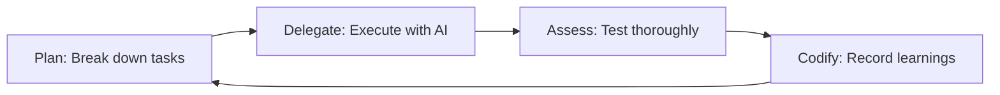

# Workflow Comparison & Recommendation
**Date**: 2025-10-16
**Task**: h-execute-comprehensive-workflow-upgrade-2025

---

## Executive Summary

Three distinct workflow approaches are now available for Vextrus ERP development:

1. **CLAUDE.md v4.0** (Agentic Workflow) - New, ultra-concise, plugin-first
2. **Sessions Protocols** (Task-Based Workflow) - Existing, proven, comprehensive
3. **Compounding Engineering** (Every Marketplace Plugin) - External, philosophy-driven

**Recommendation**: **Hybrid approach combining CLAUDE.md v4.0 as primary guide + Sessions protocols for complex tasks + Compounding Engineering for code quality cycles**

---

## Option 1: CLAUDE.md v4.0 (Agentic Workflow)

### Overview
- **Lines**: 233 (ultra-concise)
- **Philosophy**: Agent-orchestrated, plugin-driven, systematic execution
- **Models**: Sonnet 4.5 (main) + Haiku 4.5 (explore)
- **Created**: 2025-10-16 (this session)

### Structure
```
1. Core Principle (agent-orchestrated development)
2. 4-Step Workflow (Task Start → Agent Orchestration → Plugin Operations → Validation)
3. 41 Installed Plugins (organized by 11 categories)
4. 16 MCP Servers (6 auto-enabled, 10 on-demand)
5. Service Architecture (18 microservices)
6. Model Selection Guide (when to use Sonnet vs Haiku)
7. Hooks Reference (4 auto-execute observers)
8. Essential Commands
9. Quick Reference
10. Validation Checklist
11. Code Philosophy
12. Getting Started
```

### Strengths
- ✅ **Extremely concise** - 233 lines vs 515 lines (v3.0)
- ✅ **Plugin-first approach** - Leverages 41 marketplace plugins
- ✅ **Clear agent orchestration** - Sonnet breaks down → Haiku executes → Sonnet integrates
- ✅ **Minimal overhead** - Essential commands only
- ✅ **Modern CC 2.0.19 aligned** - Uses latest features (Explore, checkpoints, MCP)
- ✅ **Quick reference** - Easy to scan and find info
- ✅ **No obsolete patterns** - Removed Bangladesh compliance details, version history

### Weaknesses
- ❌ **No task lifecycle details** - Missing git workflows, branch management
- ❌ **No agent documentation** - Doesn't explain how to invoke or coordinate agents
- ❌ **No protocols** - No step-by-step procedures for complex operations
- ❌ **Assumes knowledge** - Expects user to understand plugin/agent usage
- ❌ **No templates** - Missing task creation patterns

### Best For
- Daily development work
- Quick task execution
- Plugin discovery
- General workflow reference
- New team members onboarding

---

## Option 2: Sessions Protocols (Task-Based Workflow)

### Overview
- **Location**: `sessions/protocols/`
- **Files**: 4 protocol documents
- **Philosophy**: Systematic, phase-based, checkpoint-driven
- **Created**: Evolved over 50+ completed tasks

### Structure
```
sessions/
├── protocols/
│   ├── task-startup.md        (135 lines - How to start tasks)
│   ├── task-completion.md     (165 lines - How to complete tasks)
│   ├── task-creation.md       (569 bytes - How to create tasks)
│   ├── context-compaction.md  (How to compact context)
├── templates/
│   ├── crud-service/
│   ├── data-importer/
│   ├── approval-workflow/
│   ├── integration-connector/
│   ├── report-generator/
│   └── task-creation.md
├── tasks/
│   ├── h-*.md                 (Active tasks)
│   └── done/                  (30+ completed tasks)
├── knowledge/
│   └── claude-code/           (Hooks, slash commands, subagents reference)
└── sessions-config.json       (workflow: "agent-first")
```

### Key Protocols

#### Task Startup Protocol (task-startup.md)
**Comprehensive 135-line procedure**:
1. Git Setup (branch creation, super-repo submodule management)
2. Update Task State (.claude/state/current_task.json)
3. Load Context Manifest
4. Verify Branch State
5. Work Mode (DAIC protocol, code-review agent)

**Strengths**:
- ✅ **Handles super-repo complexity** - Multiple submodule branch management
- ✅ **Git discipline** - Clear branch naming, parent branch handling
- ✅ **State management** - Explicit current_task.json format
- ✅ **Context manifest** - Structured task context loading
- ✅ **Validation** - Verify understanding before starting

**Weaknesses**:
- ❌ **Verbose** - 135 lines for task startup
- ❌ **Manual** - Requires explicit protocol following
- ❌ **Git-heavy** - Assumes complex branch workflows

#### Task Completion Protocol (task-completion.md)
**Comprehensive 165-line procedure**:
1. Pre-Completion Checks
2. Run Completion Agents (code-review, service-documentation, logging)
3. Task Archival
4. Clear Task State
5. Git Operations (commit & merge with super-repo handling)
6. Select Next Task

**Strengths**:
- ✅ **Agent-driven quality** - Automatic code review, documentation
- ✅ **Super-repo safe** - Commits from deepest submodules to root
- ✅ **Subtask handling** - Merges into parent vs main
- ✅ **Next task selection** - Systematic workflow continuation

**Weaknesses**:
- ❌ **Long procedure** - 165 lines, many steps
- ❌ **Agent invocation unclear** - References agents but no slash commands
- ❌ **Manual archival** - Explicit file moves required

### Strengths Overall
- ✅ **Battle-tested** - Used for 30+ completed tasks
- ✅ **Comprehensive** - Covers edge cases (super-repos, subtasks, experiments)
- ✅ **Systematic** - Clear step-by-step procedures
- ✅ **Agent integration** - Explicitly calls for code-review, logging agents
- ✅ **Templates provided** - 5 task templates for common patterns
- ✅ **Git workflows** - Detailed branch management, merge strategies

### Weaknesses Overall
- ❌ **Verbose** - 300+ lines across protocols
- ❌ **Manual invocation** - Requires reading and following protocols
- ❌ **Not plugin-aware** - Doesn't leverage CC 2.0.19 plugin system
- ❌ **Complex for simple tasks** - Overkill for small changes

### Best For
- Complex multi-service tasks
- Super-repo workflows
- Task with subtasks
- Tasks requiring explicit phases
- Maintaining audit trail

---

## Option 3: Compounding Engineering (Every Marketplace Plugin)

### Overview
- **Source**: https://github.com/EveryInc/every-marketplace
- **Plugin**: compounding-engineering
- **Philosophy**: Each unit of work makes next unit easier
- **Installation**: `/plugin install compounding-engineering`

### Philosophy Cycle


1. **Plan** → Break down tasks with clear steps
2. **Delegate** → Execute with AI assistance
3. **Assess** → Test thoroughly and verify quality
4. **Codify** → Record learnings for next time

### Features
- Code review with multiple expert perspectives
- Automated testing and bug reproduction
- PR management and parallel comment resolution
- Documentation generation and maintenance
- Security, performance, and architecture analysis

### Strengths
- ✅ **Compounding benefit** - Each cycle improves future cycles
- ✅ **Quality focused** - Multiple review perspectives
- ✅ **Learning capture** - Explicit codification step
- ✅ **PR workflow** - Parallel comment resolution
- ✅ **Testing automation** - Bug reproduction included

### Weaknesses
- ❌ **Unknown specifics** - No documentation on agents, commands, workflows
- ❌ **External dependency** - Not maintained by us
- ❌ **Generic** - Not ERP or Bangladesh-specific
- ❌ **Unproven** - No experience with this plugin yet

### Best For
- Code review cycles
- PR workflow automation
- Testing and quality assurance
- Learning from completed work
- Continuous improvement

---

## Detailed Comparison Matrix

| Aspect | CLAUDE.md v4.0 | Sessions Protocols | Compounding Engineering |
|--------|----------------|-------------------|------------------------|
| **Length** | 233 lines | 300+ lines (protocols) | Unknown |
| **Complexity** | Low | High | Medium |
| **Plugin Support** | ✅ 41 plugins | ❌ Not integrated | ✅ Built-in |
| **Agent Orchestration** | ✅ Clear (Sonnet/Haiku) | ✅ Referenced | ✅ Philosophy-driven |
| **Task Lifecycle** | ❌ Missing | ✅ Comprehensive | ⚠️ Partial |
| **Git Workflows** | ❌ Missing | ✅ Super-repo ready | ❌ Unknown |
| **MCP Servers** | ✅ 16 documented | ❌ Not mentioned | ❌ Unknown |
| **Quick Start** | ✅ Excellent | ❌ Complex | ⚠️ Unknown |
| **Daily Use** | ✅ Optimized | ❌ Reference-heavy | ✅ Automated |
| **Quality Gates** | ✅ Checklist | ✅ Agents required | ✅ Built-in assess |
| **Learning Capture** | ❌ None | ✅ context-refinement agent | ✅ Codify step |
| **ERP Specific** | ✅ 18 microservices | ✅ Bangladesh rules | ❌ Generic |
| **Proven** | ❌ New | ✅ 30+ tasks | ❌ Unproven |
| **Maintenance** | ✅ Controlled | ✅ Controlled | ⚠️ External |

---

## Recommendation: Hybrid Approach

### Primary: CLAUDE.md v4.0 (Daily Workflow Guide)

**Use CLAUDE.md v4.0 as the main reference** for:
- Task start (check state, explore codebase)
- Plugin discovery and usage
- MCP server enabling
- Agent selection (Sonnet vs Haiku)
- Quick commands reference
- Validation checklist

**Rationale**:
- Ultra-concise (233 lines) - easy to reference during work
- Plugin-first approach leverages 41 installed plugins
- Clear agent orchestration pattern
- Modern CC 2.0.19 aligned
- Perfect for daily development flow

### Secondary: Sessions Protocols (Complex Task Handling)

**Reference `sessions/protocols/` when**:
- Starting complex multi-service tasks
- Working with super-repo submodules
- Creating tasks from templates
- Completing tasks with formal archival
- Managing subtask hierarchies
- Need systematic git workflow

**Rationale**:
- Battle-tested over 30+ completed tasks
- Comprehensive edge case handling
- Explicit phase-based execution
- Git workflow discipline
- Quality gate enforcement

**Integration**:
- Add references in CLAUDE.md v4.0 to protocols:
  ```markdown
  ## Complex Task Workflows

  For multi-service tasks with git complexity, see:
  - `sessions/protocols/task-startup.md` - Comprehensive startup procedure
  - `sessions/protocols/task-completion.md` - Quality gates and archival
  - `sessions/templates/` - Task creation templates
  ```

### Tertiary: Compounding Engineering (Quality Cycles)

**Install and use for**:
- Code review before PR creation
- Automated test generation
- PR comment resolution workflow
- Documentation maintenance
- Security/performance analysis
- Learning capture from completed work

**Installation**:
```bash
/plugin install compounding-engineering
```

**Integration into workflow**:
- **Plan** phase: Use before starting implementation
- **Delegate** phase: Execute with plugin assistance
- **Assess** phase: Automated testing and validation
- **Codify** phase: Update knowledge base with learnings

**Rationale**:
- Complements existing workflows
- Quality-focused philosophy aligns with Vextrus goals
- Compounding benefits over time
- External maintenance (no overhead)

---

## Proposed Unified Workflow

### Phase 1: Task Start (CLAUDE.md v4.0)
```bash
# 1. Check current state (CLAUDE.md reference)
cat .claude/state/current_task.json
git branch --show-current

# 2. For complex tasks: Follow sessions/protocols/task-startup.md
#    - Git setup, branch creation
#    - Update task state
#    - Load context manifest
#    - Verify branch state

# 3. Explore with Haiku 4.5 (CLAUDE.md agent orchestration)
/explore services/finance

# 4. Plan with Compounding Engineering
#    Use compounding-engineering plugin to break down task
```

### Phase 2: Implementation (CLAUDE.md v4.0 + Plugins)
```bash
# 1. Agent orchestration (CLAUDE.md pattern)
#    - Sonnet 4.5: Complex logic, architecture decisions
#    - Haiku 4.5: Parallel exploration, quick prototyping

# 2. Plugin-driven operations (CLAUDE.md reference)
/review          # code-review-ai
/test            # unit-testing
/security-scan   # security-scanning

# 3. Delegate with Compounding Engineering
#    Execute implementation with plugin assistance
```

### Phase 3: Validation (CLAUDE.md v4.0 checklist + Compounding Assess)
```bash
# 1. Automatic validation (CLAUDE.md checklist)
- [ ] Security scan (security-scanning plugin)
- [ ] Code review (code-review-ai plugin)
- [ ] Performance check (application-performance plugin)
- [ ] Tests pass (unit, integration, E2E)
- [ ] Documentation updated

# 2. Assess with Compounding Engineering
#    Test thoroughly, verify quality
```

### Phase 4: Completion (Sessions protocol + Compounding Codify)
```bash
# 1. Follow sessions/protocols/task-completion.md
#    - Pre-completion checks
#    - Run completion agents (code-review, service-documentation, logging)
#    - Task archival
#    - Git operations (commit & merge)

# 2. Codify with Compounding Engineering
#    Record learnings for next time
#    Update knowledge base
```

---

## Implementation Plan

### Step 1: Update CLAUDE.md v4.0 (Add Protocol References)

Add new section after "Essential Commands":

```markdown
## Complex Task Workflows

For multi-service tasks requiring systematic git management:
- **Task Startup**: `sessions/protocols/task-startup.md` (135 lines)
- **Task Completion**: `sessions/protocols/task-completion.md` (165 lines)
- **Task Templates**: `sessions/templates/` (5 templates)

Use when:
- Working with super-repo submodules
- Creating tasks with multiple phases
- Managing subtask hierarchies
- Requiring formal task archival
```

### Step 2: Install Compounding Engineering Plugin

```bash
/plugin install compounding-engineering

# Or one-command:
npx claude-plugins install @EveryInc/every-marketplace/compounding-engineering
```

### Step 3: Test Hybrid Workflow

**Test Case**: Current finance backend task (h-implement-finance-backend-business-logic)

1. **Task Start** (CLAUDE.md v4.0):
   - Check state: `cat .claude/state/current_task.json`
   - Explore: `/explore services/finance`
   - Reference: Read `services/finance/CLAUDE.md`

2. **Complex Setup** (Sessions protocol):
   - Follow `sessions/protocols/task-startup.md` if needed
   - Git branch management
   - Context manifest loading

3. **Planning** (Compounding Engineering):
   - Break down business logic implementation
   - Use Plan phase to detail steps

4. **Implementation** (CLAUDE.md v4.0 + Plugins):
   - Agent orchestration: Sonnet for complex CQRS logic
   - Plugin operations: `/review`, `/test`, `/security-scan`
   - Delegate: Execute with plugin assistance

5. **Validation** (CLAUDE.md v4.0 checklist + Compounding Assess):
   - Run all validation checks
   - Test thoroughly with plugin automation

6. **Completion** (Sessions protocol + Compounding Codify):
   - Follow `sessions/protocols/task-completion.md`
   - Record learnings with Codify phase

### Step 4: Validate and Refine

**Success Criteria**:
- ✅ Quick daily tasks completed using only CLAUDE.md v4.0
- ✅ Complex tasks successfully handled with protocol reference
- ✅ Compounding Engineering plugin integrated into quality cycles
- ✅ No confusion about which approach to use when
- ✅ Team can onboard with CLAUDE.md v4.0, graduate to protocols

---

## Decision Matrix: Which Approach When?

| Scenario | Primary | Secondary | Tertiary |
|----------|---------|-----------|----------|
| **Daily bug fix** | CLAUDE.md v4.0 | - | Compounding (assess) |
| **New feature (single service)** | CLAUDE.md v4.0 | - | Compounding (plan + assess) |
| **New feature (multi-service)** | CLAUDE.md v4.0 | Sessions protocol | Compounding (full cycle) |
| **Complex refactoring** | Sessions protocol | CLAUDE.md v4.0 | Compounding (full cycle) |
| **Database migration** | Sessions protocol | CLAUDE.md v4.0 | Compounding (plan) |
| **PR creation** | CLAUDE.md v4.0 | - | Compounding (review + docs) |
| **Code review** | Compounding | CLAUDE.md v4.0 | - |
| **Quick exploration** | CLAUDE.md v4.0 (Haiku) | - | - |
| **Architecture decision** | CLAUDE.md v4.0 (Sonnet) | Sessions protocol | Compounding (plan) |
| **Super-repo work** | Sessions protocol | CLAUDE.md v4.0 | - |

---

## Conclusion

### Recommended Approach: **Hybrid**

**Do NOT choose one workflow over another.** Each serves distinct purposes:

1. **CLAUDE.md v4.0** = Daily development guide (233 lines, quick reference)
2. **Sessions Protocols** = Complex task procedures (battle-tested, comprehensive)
3. **Compounding Engineering** = Quality improvement cycles (plugin-based, automated)

### Strengths of Hybrid
- ✅ **Best of all worlds** - Concise daily guide + comprehensive procedures + quality automation
- ✅ **Flexible** - Choose appropriate depth for task complexity
- ✅ **Proven + Modern** - Combines battle-tested protocols with latest plugins
- ✅ **Team scalable** - Beginners use CLAUDE.md, experts use protocols
- ✅ **Compounding benefits** - Learning accumulates over time

### Maintenance Strategy
- **CLAUDE.md v4.0**: Keep ultra-concise, update only when plugins/commands change
- **Sessions Protocols**: Leave unchanged (proven over 30+ tasks)
- **Compounding Engineering**: External maintenance (marketplace updates)

### Action Items
1. ✅ Keep CLAUDE.md v4.0 as primary guide
2. ✅ Keep sessions/protocols/ for complex workflows
3. 🔄 Install compounding-engineering plugin
4. 🔄 Add protocol references to CLAUDE.md v4.0
5. 🔄 Test hybrid approach on finance backend task
6. 🔄 Refine based on learnings

---

**Version**: 1.0
**Status**: Recommendation Complete
**Next**: User decision and implementation
