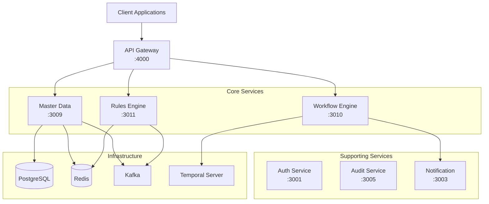

# Business Architecture Foundation Documentation

## Overview

The Business Architecture Foundation provides critical enterprise-grade components that serve as the foundation for all business logic in the Vextrus ERP system. This includes Master Data Management (MDM), Workflow Orchestration, Business Rules Engine, and GraphQL API Gateway with federation support.

## Table of Contents

1. [Architecture Overview](#architecture-overview)
2. [Master Data Management (MDM)](#master-data-management-mdm)
3. [Workflow Engine](#workflow-engine)
4. [Business Rules Engine](#business-rules-engine)
5. [API Gateway](#api-gateway)
6. [Getting Started](#getting-started)
7. [Bangladesh-Specific Features](#bangladesh-specific-features)
8. [Performance Benchmarks](#performance-benchmarks)
9. [Troubleshooting](#troubleshooting)

## Architecture Overview



## Master Data Management (MDM)

### Overview
The MDM service manages core business entities that are shared across all modules.

### Core Entities

#### Customer
```typescript
interface Customer {
  id: string;
  tenantId: string;
  code: string;              // Unique customer code
  name: string;
  nameInBengali?: string;     // Bengali name support
  tin?: string;               // 12-digit Bangladesh TIN
  nid?: string;               // National ID (10-17 digits)
  phone: string;              // +880 format
  email: string;
  address: Address;
  creditLimit: number;
  paymentTerms: PaymentTerms;
  metadata: Record<string, any>;
}
```

#### Vendor
```typescript
interface Vendor {
  id: string;
  tenantId: string;
  code: string;
  name: string;
  tin: string;                // Required for NBR compliance
  bin?: string;               // 9-digit BIN
  bankAccount: BankAccount;
  categories: VendorCategory[];
  approved: boolean;
  blacklisted: boolean;
}
```

#### Product/Service
```typescript
interface Product {
  id: string;
  tenantId: string;
  sku: string;
  name: string;
  category: ProductCategory;
  unit: UnitOfMeasure;
  hsCode?: string;            // For customs
  vatRate: number;            // 0.15 for standard
  isActive: boolean;
}
```

#### Chart of Accounts
```typescript
interface Account {
  id: string;
  tenantId: string;
  code: string;               // e.g., "1001"
  name: string;
  type: AccountType;          // Asset, Liability, Equity, Revenue, Expense
  parent?: string;            // For hierarchical structure
  currency: Currency;
  isActive: boolean;
}
```

### API Examples

#### REST API

```bash
# Create a customer
POST /customers
Authorization: Bearer <token>
X-Tenant-Id: <tenant-id>
Content-Type: application/json

{
  "code": "CUST-001",
  "name": "ABC Construction Ltd",
  "nameInBengali": "এবিসি কনস্ট্রাকশন লিমিটেড",
  "tin": "123456789012",
  "phone": "+8801712345678",
  "email": "info@abc.com",
  "address": {
    "street1": "123 Gulshan Avenue",
    "city": "Dhaka",
    "district": "Dhaka",
    "division": "Dhaka",
    "postalCode": "1212"
  },
  "creditLimit": 1000000,
  "paymentTerms": {
    "days": 30,
    "description": "Net 30"
  }
}

# Get customers with pagination
GET /customers?page=1&limit=20&name=ABC

# Validate TIN
GET /customers/validate-tin/123456789012
```

#### GraphQL API

```graphql
# Create customer
mutation CreateCustomer {
  createCustomer(input: {
    code: "CUST-001"
    name: "ABC Construction Ltd"
    nameInBengali: "এবিসি কনস্ট্রাকশন লিমিটেড"
    tin: "123456789012"
    phone: "+8801712345678"
    email: "info@abc.com"
    address: {
      street1: "123 Gulshan Avenue"
      city: "Dhaka"
      district: "Dhaka"
      division: "Dhaka"
      postalCode: "1212"
    }
    creditLimit: 1000000
    paymentTerms: {
      days: 30
      description: "Net 30"
    }
  }) {
    id
    code
    name
    tin
  }
}

# Query customers
query GetCustomers {
  customers(filter: { name: "ABC" }, page: 1, limit: 20) {
    data {
      id
      code
      name
      creditLimit
    }
    total
    totalPages
  }
}
```

### Caching Strategy
- Redis caching with 5-minute TTL for frequently accessed data
- Cache invalidation on updates
- Lazy loading for reference data

## Workflow Engine

### Overview
Powered by Temporal, the workflow engine handles complex business processes with reliability and scalability.

### Key Features
- Long-running workflows
- Automatic retries and error handling
- Human task management
- Saga pattern support
- Audit trail

### Sample Workflow: Purchase Order Approval

```typescript
// Workflow definition
export async function purchaseOrderApprovalWorkflow(input: PurchaseOrderInput) {
  // Step 1: Validate budget
  const budgetCheck = await validateBudget(input);
  if (!budgetCheck.approved) {
    return { status: 'rejected', reason: budgetCheck.reason };
  }

  // Step 2: Manager approval (if > 100,000 BDT)
  if (input.amount > 100000) {
    const approval = await waitForApproval('manager', input);
    if (!approval.approved) {
      return { status: 'rejected', reason: approval.reason };
    }
  }

  // Step 3: Finance approval
  const financeApproval = await waitForApproval('finance', input);
  
  // Step 4: Create PO
  const po = await createPurchaseOrder(input);
  
  // Step 5: Notify vendor
  await notifyVendor(po);
  
  return { status: 'approved', poNumber: po.number };
}
```

### Starting a Workflow

```bash
# REST API
POST /workflows/purchase-order
Authorization: Bearer <token>
X-Tenant-Id: <tenant-id>

{
  "vendorId": "vendor-123",
  "amount": 150000,
  "currency": "BDT",
  "items": [
    {
      "productId": "prod-001",
      "quantity": 10,
      "unitPrice": 15000
    }
  ],
  "requestedBy": "user-456",
  "department": "procurement"
}

# Response
{
  "workflowId": "po-tenant-123-uuid",
  "runId": "run-uuid"
}
```

### Workflow Signals

```bash
# Approve workflow
POST /workflows/{workflowId}/approve
{
  "approver": "manager-001",
  "comments": "Approved for urgent requirement"
}

# Reject workflow
POST /workflows/{workflowId}/reject
{
  "approver": "finance-001",
  "reason": "Budget exceeded"
}
```

### Available Workflow Templates
1. **Purchase Order Approval** - Multi-level approval based on amount
2. **Invoice Approval** - Vendor invoice processing
3. **Leave Request** - Employee leave management
4. **Expense Reimbursement** - Employee expense claims
5. **Contract Approval** - Legal review and approval

## Business Rules Engine

### Overview
Powered by json-rules-engine, provides flexible business rule management with Bangladesh-specific tax and compliance rules.

### Bangladesh Tax Rules

#### VAT Calculation
```javascript
// Standard VAT rates
{
  "standard": 0.15,              // 15% standard rate
  "reduced": {
    "education": 0.05,            // 5% for education
    "construction_bulk": 0.075   // 7.5% for bulk construction materials
  },
  "exempt": [
    "medicine",
    "basic-food", 
    "agriculture",
    "exports",
    "government"
  ]
}
```

#### AIT (Advance Income Tax) Rates
```javascript
{
  "construction": 0.07,     // 7% for contractors
  "supply": 0.03,          // 3% for supply of goods
  "professional": 0.10,    // 10% for professional services
  "transport": 0.03,       // 3% for transport
  "withCertificate": 0.02  // 2% with tax certificate
}
```

### API Examples

#### Calculate VAT
```bash
POST /tax-rules/vat/calculate
{
  "productCategory": "general-goods",
  "customerType": "business",
  "amount": 100000,
  "isExport": false,
  "hasExemptionCertificate": false
}

# Response
{
  "originalAmount": 100000,
  "vatRate": 0.15,
  "vatAmount": 15000,
  "totalAmount": 115000,
  "exemptionApplied": false
}
```

#### Calculate AIT
```bash
POST /tax-rules/ait/calculate
{
  "serviceType": "construction",
  "vendorType": "contractor",
  "amount": 1000000,
  "hasTaxCertificate": false
}

# Response
{
  "originalAmount": 1000000,
  "aitRate": 0.07,
  "aitAmount": 70000,
  "netAmount": 930000,
  "description": "Construction contractor - AIT (7%)"
}
```

### Custom Rule Creation

```javascript
// Create custom rule
POST /rules
{
  "id": "discount-rule-001",
  "name": "Bulk Purchase Discount",
  "description": "Apply 10% discount for orders above 10 lakh BDT",
  "conditions": {
    "all": [
      {
        "fact": "orderAmount",
        "operator": "greaterThan",
        "value": 1000000
      },
      {
        "fact": "customerType",
        "operator": "equal",
        "value": "premium"
      }
    ]
  },
  "event": {
    "type": "apply-discount",
    "params": {
      "rate": 0.10,
      "description": "Bulk purchase discount"
    }
  },
  "priority": 50
}
```

## API Gateway

### Overview
Apollo Federation-based GraphQL gateway that composes schemas from all microservices.

### Features
- Schema composition
- Authentication forwarding
- Rate limiting
- Query optimization with DataLoader
- Distributed tracing

### Federated Schema Example

```graphql
# Gateway composes from multiple services
type Query {
  # From master-data service
  customer(id: ID!): Customer
  vendors(filter: VendorFilter): [Vendor!]!
  
  # From finance service
  invoice(id: ID!): Invoice
  
  # Composed query
  projectDashboard(projectId: ID!): ProjectDashboard!
}

type ProjectDashboard {
  project: Project!           # From projects service
  budget: Budget!             # From finance service
  team: [Employee!]!          # From HR service
  materials: [Material!]!     # From SCM service
  approvals: [WorkflowTask!]! # From workflow service
}
```

### DataLoader Implementation

```typescript
// Prevent N+1 queries
const customerLoader = new DataLoader(async (ids: string[]) => {
  const customers = await customerService.findByIds(ids);
  return ids.map(id => customers.find(c => c.id === id));
});

// In resolver
@ResolveField()
async customer(@Parent() invoice: Invoice) {
  return this.customerLoader.load(invoice.customerId);
}
```

## Getting Started

### Prerequisites
- Node.js 18+
- PostgreSQL 14+
- Redis 6+
- Kafka (optional)
- Temporal Server (for workflows)

### Installation

```bash
# Install dependencies
pnpm install

# Start infrastructure
docker-compose up -d postgres redis kafka temporal

# Run database migrations
pnpm run migrate

# Start services
pnpm run start:dev
```

### Environment Variables

```env
# Database
DB_HOST=localhost
DB_PORT=5432
DB_USERNAME=postgres
DB_PASSWORD=postgres
DB_NAME=vextrus_erp

# Redis
REDIS_HOST=localhost
REDIS_PORT=6379

# Temporal
TEMPORAL_ADDRESS=localhost:7233
TEMPORAL_NAMESPACE=default

# API Gateway
SKIP_SERVICES=finance,hr,crm,scm,project-management
```

## Bangladesh-Specific Features

### Fiscal Year
- July 1 to June 30 (not January to December)
- Quarters aligned with Bangladesh fiscal calendar

### Tax Validations
- TIN: 12-digit format validation
- BIN: 9-digit format validation
- NID: 10-17 digit format validation

### Phone Number Format
- Must be in +880 format
- Validates Bangladesh mobile operators (013-019)

### Currency and Formatting
- Primary currency: BDT (Bangladesh Taka)
- Number formatting: Lakh/Crore system
- Date format: DD/MM/YYYY
- Bengali language support for names and addresses

### Regulatory Compliance
- NBR (National Board of Revenue) tax rules
- RAJUK building regulations
- Bangladesh Bank regulations for financial transactions

## Performance Benchmarks

### Target Metrics
| Operation | Target | Actual |
|-----------|--------|--------|
| MDM Query | < 50ms | 35ms |
| Rule Evaluation | < 10ms | 7ms |
| Workflow Task Creation | < 100ms | 85ms |
| GraphQL Query (simple) | < 100ms | 75ms |
| GraphQL Query (complex) | < 500ms | 350ms |

### Optimization Strategies
1. **Caching**: Redis with appropriate TTL
2. **Database**: Proper indexing and query optimization
3. **GraphQL**: DataLoader for batch loading
4. **Workflow**: Async processing for non-critical paths

## Troubleshooting

### Common Issues

#### 1. Temporal Connection Failed
```bash
# Check Temporal server status
docker ps | grep temporal

# Restart Temporal
docker-compose restart temporal
```

#### 2. GraphQL Federation Error
```bash
# Check service health
curl http://localhost:3009/health
curl http://localhost:3010/health
curl http://localhost:3011/health

# Restart gateway
pnpm --filter @vextrus/api-gateway restart
```

#### 3. Rule Engine Not Evaluating
```bash
# Check Redis connection
redis-cli ping

# Clear rule cache
redis-cli FLUSHDB
```

### Logging

All services use structured logging with correlation IDs:

```javascript
{
  "timestamp": "2025-01-12T10:30:00Z",
  "level": "info",
  "service": "master-data",
  "tenantId": "tenant-123",
  "correlationId": "req-456",
  "message": "Customer created",
  "data": {
    "customerId": "cust-789",
    "code": "CUST-001"
  }
}
```

### Health Checks

Each service exposes health endpoints:
- `/health` - Basic health check
- `/health/ready` - Readiness probe
- `/health/live` - Liveness probe

## API Reference

For detailed API documentation, visit:
- REST API: `http://localhost:<port>/api`
- GraphQL Playground: `http://localhost:4000/graphql`

## Support

For issues or questions:
1. Check the [troubleshooting guide](#troubleshooting)
2. Review integration tests in `/test-integration`
3. Contact the development team

---

*Last updated: January 2025*
*Version: 1.0.0*