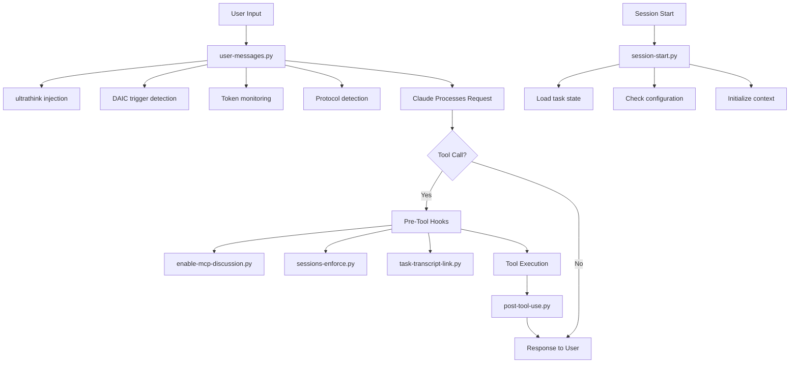
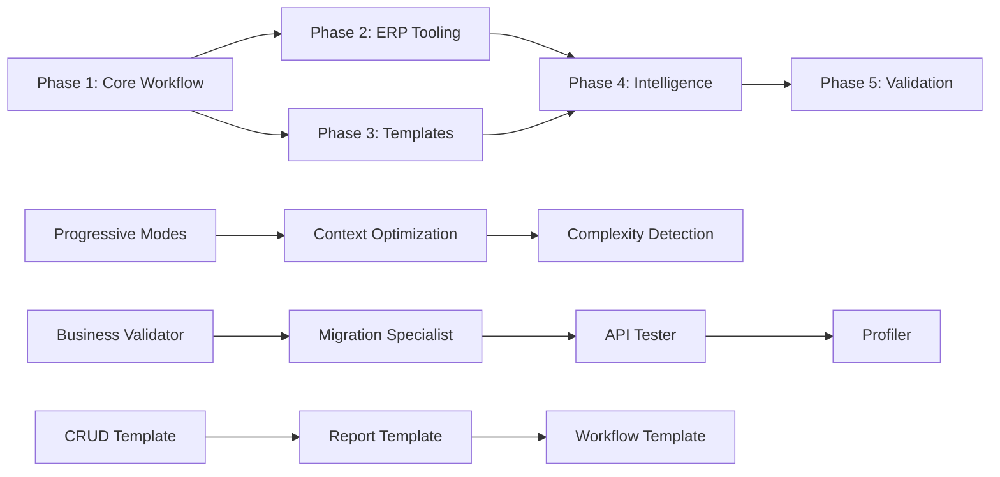

# Claude Code Workflow Analysis & Optimization Blueprint

## Executive Summary
This document provides a comprehensive analysis of the current Claude Code workflow system and detailed specifications for enterprise-grade optimizations needed for production ERP deployment.

## Part 1: Current System Architecture

### Hook Execution Flow



### State Management System

**Core State Files:**
- `.claude/state/daic-mode.json` - Discussion/Implementation mode toggle
- `.claude/state/current_task.json` - Active task, branch, services
- `.claude/state/context-warning-*.flag` - Token usage warnings
- `.claude/state/in_subagent_context.flag` - Subagent execution flag
- `.claude/state/{agent}/current_transcript_*.json` - Chunked transcripts

### DAIC Workflow Mechanism

**Current Binary Mode System:**
1. **Discussion Mode** (default)
   - Blocks: Edit, Write, MultiEdit, NotebookEdit
   - Allows: All read operations, MCP tools, Bash read-only commands
   - Purpose: Planning, investigation, alignment

2. **Implementation Mode** (triggered)
   - Allows: All tools
   - Trigger phrases: "make it so", "run that", "yert"
   - Auto-reminder: "When done, run: daic"
   - Purpose: Execute agreed-upon changes

**Mode Transitions:**
```
Discussion --[trigger phrase]--> Implementation
Implementation --[daic command]--> Discussion
Any Mode --[STOP/SILENCE]--> Discussion (emergency)
```

### Agent System Architecture

**Current Agents:**
1. **context-gathering** - Builds comprehensive context manifests
2. **context-refinement** - Updates context with session discoveries
3. **logging** - Consolidates work logs
4. **service-documentation** - Updates CLAUDE.md files
5. **code-review** - Reviews code for quality/security

**Agent Invocation Pattern:**
```python
# Via Task tool with subagent_type
Task(
    subagent_type="context-gathering",
    description="short description",
    prompt="detailed instructions"
)
```

### MCP Server Integration

**Active Servers (15+):**
- **Data:** sqlite, postgres, prisma-remote
- **Search:** brave-search, brightdata, context7
- **Development:** serena, filesystem, github
- **Utilities:** memory, sequential-thinking, consult7
- **External:** notion, reddit, playwright

## Part 2: Pain Points & Optimization Opportunities

### 1. Context Window Inefficiencies

**Current Issues:**
- Linear token accumulation without smart pruning
- Full file reads when only symbols needed
- Redundant information across sessions
- No automatic archiving of completed subtasks

**Optimization Opportunities:**
- Implement sliding window with relevance scoring
- Symbol-based reading with serena tools
- Automatic context summarization at checkpoints
- Smart archiving of completed work

### 2. Mode Switching Friction

**Current Issues:**
- Binary discussion/implementation modes too rigid
- Frequent mode switching for simple operations
- No gradual transition for exploration
- Same restrictions for all operation types

**Optimization Opportunities:**
- Progressive modes: explore → prototype → implement → validate → deploy
- Context-aware mode suggestions
- Granular permissions per mode
- Automatic mode elevation for safe operations

### 3. Repetitive Patterns

**Current Issues:**
- Same CRUD patterns reimplemented repeatedly
- No template system for common structures
- Manual service setup each time
- Duplicate validation logic across services

**Optimization Opportunities:**
- Template library for common patterns
- Service generators with ERP defaults
- Shared validation rule registry
- Pattern recognition and suggestion system

### 4. Limited Business Logic Validation

**Current Issues:**
- No ERP-specific validation
- Business rules scattered across code
- No compliance checking
- Manual data migration planning

**Optimization Opportunities:**
- Business-logic-validator agent
- Centralized business rule engine
- Compliance check pipelines
- Data-migration-specialist agent

### 5. Weak Dependency Management

**Current Issues:**
- Manual tracking of service dependencies
- No automatic impact analysis
- Hidden integration points
- Manual performance baseline tracking

**Optimization Opportunities:**
- Automatic dependency graph generation
- Impact analysis before changes
- Integration point catalog
- Performance regression detection

## Part 3: Detailed Implementation Specifications

### Phase 1: Core Workflow Enhancements

#### 1.1 Progressive Mode System

```python
# New mode configuration
PROGRESSIVE_MODES = {
    "explore": {
        "permissions": {
            "read": ["*"],
            "write": [],
            "execute": ["read_only_bash", "mcp_tools"]
        },
        "auto_elevate": ["prototype"],
        "context_retention": "full"
    },
    "prototype": {
        "permissions": {
            "read": ["*"],
            "write": ["test_dirs", "*.test.*", "*.spec.*"],
            "execute": ["*"]
        },
        "auto_elevate": ["implement"],
        "context_retention": "relevant"
    },
    "implement": {
        "permissions": {
            "read": ["*"],
            "write": ["*"],
            "execute": ["*"]
        },
        "auto_elevate": ["validate"],
        "context_retention": "changes_only"
    },
    "validate": {
        "permissions": {
            "read": ["*"],
            "write": [],
            "execute": ["test_commands", "lint", "typecheck"]
        },
        "auto_elevate": ["deploy"],
        "context_retention": "results"
    },
    "deploy": {
        "permissions": {
            "read": ["*"],
            "write": ["configs", "manifests"],
            "execute": ["deploy_commands", "rollback"]
        },
        "requires_confirmation": true,
        "context_retention": "audit_trail"
    }
}
```

#### 1.2 Context Optimization Algorithm

```python
# Smart context management
class ContextOptimizer:
    def __init__(self):
        self.relevance_threshold = 0.7
        self.max_context_tokens = 160000
        self.archive_threshold = 50000
        
    def optimize_context(self, transcript):
        # Score each message for relevance
        scored = self.score_relevance(transcript)
        
        # Archive completed subtasks
        archived = self.archive_completed(scored)
        
        # Summarize old discussions
        summarized = self.summarize_old(archived)
        
        # Keep only relevant recent context
        optimized = self.filter_relevant(summarized)
        
        return optimized
        
    def score_relevance(self, message):
        factors = {
            "recency": self.calculate_recency_score(message),
            "task_relevance": self.calculate_task_relevance(message),
            "tool_usage": self.calculate_tool_importance(message),
            "user_emphasis": self.detect_user_emphasis(message)
        }
        return weighted_average(factors)
```

#### 1.3 Complexity Detection

```python
# Automatic task splitting
class ComplexityAnalyzer:
    def analyze_task(self, task_description):
        metrics = {
            "estimated_files": self.count_affected_files(task_description),
            "estimated_loc": self.estimate_lines_of_code(task_description),
            "service_count": self.count_affected_services(task_description),
            "integration_points": self.count_integrations(task_description),
            "business_rules": self.count_business_rules(task_description)
        }
        
        complexity_score = self.calculate_complexity(metrics)
        
        if complexity_score > 8:
            return {
                "should_split": True,
                "suggested_subtasks": self.generate_subtasks(task_description),
                "reasoning": self.explain_complexity(metrics)
            }
        return {"should_split": False}
```

### Phase 2: ERP-Specific Tooling

#### 2.1 Business Logic Validator Agent

```yaml
agent: business-logic-validator
purpose: Validate business logic against ERP best practices
tools:
  - Read
  - Grep
  - serena tools
knowledge_base:
  - Bangladesh construction regulations
  - Double-entry accounting rules
  - Inventory valuation methods
  - Tax calculation rules
  - Approval hierarchies

responsibilities:
  - Validate accounting entries balance
  - Check tax calculations
  - Verify approval workflows
  - Validate inventory movements
  - Check financial period constraints
  - Ensure audit trail completeness

integration:
  - Triggered before commits to finance modules
  - Runs as part of validation pipeline
  - Generates compliance reports
```

#### 2.2 Data Migration Specialist Agent

```yaml
agent: data-migration-specialist
purpose: Plan and validate data migrations
tools:
  - Read
  - Write
  - SQL execution via MCP
  - Data profiling tools

responsibilities:
  - Analyze source data schema
  - Generate migration mappings
  - Create rollback procedures
  - Validate data integrity
  - Generate test data sets
  - Plan phased migrations

workflow:
  1. Profile source data
  2. Map to target schema
  3. Identify transformations
  4. Generate migration script
  5. Create validation queries
  6. Plan rollback strategy
```

#### 2.3 API Integration Tester Agent

```yaml
agent: api-integration-tester
purpose: Test API contracts and integrations
tools:
  - Playwright for API testing
  - Contract validation
  - Load testing tools

responsibilities:
  - Validate API contracts
  - Test error scenarios
  - Check rate limiting
  - Verify authentication
  - Test pagination
  - Load test endpoints
```

#### 2.4 Performance Profiler Agent

```yaml
agent: performance-profiler
purpose: Profile and optimize performance
tools:
  - Performance monitoring
  - Query analysis
  - Memory profiling

responsibilities:
  - Identify bottlenecks
  - Analyze query performance
  - Check memory usage
  - Monitor API response times
  - Track performance trends
  - Suggest optimizations
```

### Phase 3: Template & Pattern Library

#### 3.1 CRUD Service Template

```typescript
// Template structure
interface CRUDServiceTemplate {
  entity: {
    name: string;
    fields: Field[];
    validations: Validation[];
    indexes: Index[];
  };
  
  api: {
    routes: RouteConfig[];
    middleware: Middleware[];
    permissions: Permission[];
  };
  
  business: {
    rules: BusinessRule[];
    workflows: Workflow[];
    notifications: Notification[];
  };
  
  testing: {
    fixtures: Fixture[];
    scenarios: TestScenario[];
  };
}

// Generator command
// claude generate:service --type=crud --entity=Customer --module=crm
```

#### 3.2 Report Generator Template

```typescript
interface ReportTemplate {
  datasource: {
    queries: Query[];
    joins: Join[];
    aggregations: Aggregation[];
  };
  
  layout: {
    format: 'pdf' | 'excel' | 'html';
    sections: Section[];
    charts: Chart[];
  };
  
  scheduling: {
    frequency: CronExpression;
    recipients: Recipient[];
  };
}
```

#### 3.3 Approval Workflow Template

```typescript
interface ApprovalWorkflowTemplate {
  triggers: Trigger[];
  stages: ApprovalStage[];
  escalations: Escalation[];
  notifications: Notification[];
  audit: AuditConfig;
}
```

### Phase 4: Intelligence Layer

#### 4.1 Service Dependency Graph

```python
# Automatic dependency detection
class DependencyGraphGenerator:
    def generate(self):
        graph = {
            "nodes": self.discover_services(),
            "edges": self.discover_dependencies(),
            "clusters": self.identify_clusters(),
            "critical_paths": self.find_critical_paths()
        }
        
        return self.visualize(graph)
    
    def discover_dependencies(self):
        patterns = [
            "import_statements",
            "api_calls",
            "database_references",
            "message_queue_topics",
            "shared_types"
        ]
        # Scan codebase for dependency patterns
```

#### 4.2 Business Rule Registry

```yaml
# Centralized business rules
business_rules:
  finance:
    double_entry:
      rule: "Every debit must have equal credits"
      validator: validateDoubleEntry
      applies_to: ["journal_entries", "transactions"]
    
    period_closure:
      rule: "No postings to closed periods"
      validator: validatePeriodOpen
      applies_to: ["all_financial_transactions"]
  
  inventory:
    negative_stock:
      rule: "Stock cannot go negative unless configured"
      validator: validateStockLevel
      configuration: allow_negative_stock
```

#### 4.3 Integration Point Catalog

```json
{
  "integrations": [
    {
      "service": "auth-service",
      "exposes": [
        {
          "type": "REST",
          "endpoint": "/api/v1/auth/*",
          "authentication": "JWT",
          "rate_limit": "1000/hour"
        }
      ],
      "consumes": [
        {
          "service": "user-service",
          "endpoint": "/api/v1/users/*"
        }
      ]
    }
  ]
}
```

### Phase 5: Validation & Testing Pipeline

#### 5.1 Pre-Implementation Checks

```python
# Run before any implementation
class PreImplementationValidator:
    def validate(self, task):
        checks = [
            self.check_dependencies_available(),
            self.check_breaking_changes(),
            self.check_migration_needed(),
            self.check_performance_impact(),
            self.check_security_implications()
        ]
        
        if not all(checks):
            return {
                "can_proceed": False,
                "blockers": self.identify_blockers(checks),
                "suggestions": self.generate_suggestions()
            }
```

#### 5.2 Business Rule Compliance

```python
class BusinessRuleValidator:
    def validate_changes(self, changes):
        for change in changes:
            module = self.identify_module(change)
            rules = self.get_rules_for_module(module)
            
            for rule in rules:
                if not rule.validate(change):
                    raise BusinessRuleViolation(rule, change)
```

#### 5.3 API Contract Validator

```python
class APIContractValidator:
    def validate_contract(self, endpoint, changes):
        contract = self.load_contract(endpoint)
        
        # Check request compatibility
        self.validate_request_compatibility(contract, changes)
        
        # Check response compatibility
        self.validate_response_compatibility(contract, changes)
        
        # Check versioning
        self.validate_version_compatibility(contract, changes)
```

## Part 4: Implementation Roadmap

### Dependency Graph



### Critical Path

1. **Week 1**: Progressive modes implementation
2. **Week 2**: Context optimization
3. **Week 3**: Business logic validator
4. **Week 4**: CRUD template system
5. **Week 5**: Dependency graph generator
6. **Week 6**: Validation pipeline
7. **Week 7**: Integration testing
8. **Week 8**: Documentation and rollout

### Risk Mitigation

**Backwards Compatibility:**
- All changes behind feature flags
- Gradual rollout per developer
- Fallback to current system
- Parallel run period

**Performance Impact:**
- Benchmark before changes
- Profile each enhancement
- Set performance budgets
- Monitor in production

## Part 5: Success Metrics

### Quantitative Metrics

| Metric | Current | Target | Measurement |
|--------|---------|--------|-------------|
| Context usage per task | 80k tokens | 48k tokens | 40% reduction |
| Task completion time | 4 hours | 2.8 hours | 30% reduction |
| Business logic errors | 15 per module | 1.5 per module | 90% reduction |
| API contract violations | 8 per sprint | 0 per sprint | 100% elimination |
| Code review iterations | 3 rounds | 1 round | 67% reduction |
| Template usage | 0% | 80% | New metric |
| Dependency clarity | Manual | Automated | 100% automated |

### Qualitative Metrics

- Developer satisfaction score
- Code consistency rating
- Onboarding time for new developers
- Confidence in production deployments
- Stakeholder trust level

## Appendix A: Configuration Examples

### Enhanced .claude/settings.json

```json
{
  "workflow": {
    "mode": "progressive",
    "default_mode": "explore",
    "auto_elevation": true,
    "elevation_triggers": {
      "prototype": ["test written", "poc complete"],
      "implement": ["design approved", "tests passing"],
      "validate": ["implementation complete"],
      "deploy": ["validation passed", "review approved"]
    }
  },
  
  "context": {
    "optimization": "aggressive",
    "archive_completed": true,
    "summarize_after": 30000,
    "relevance_threshold": 0.7,
    "max_tokens": 160000,
    "warning_at": [75, 90]
  },
  
  "templates": {
    "auto_suggest": true,
    "preferred_patterns": ["repository", "service", "factory"],
    "naming_convention": "kebab-case",
    "test_framework": "jest"
  },
  
  "validation": {
    "pre_commit": ["lint", "typecheck", "test"],
    "business_rules": "strict",
    "api_contracts": "enforce",
    "performance_budget": {
      "api_response": 200,
      "query_time": 100,
      "memory_limit": 512
    }
  },
  
  "agents": {
    "auto_invoke": {
      "business-validator": ["finance/*", "inventory/*"],
      "api-tester": ["*/api/*"],
      "profiler": ["performance_critical"]
    }
  }
}
```

### Task File with Intelligence Metadata

```markdown
---
task: implement-purchase-order
branch: feature/purchase-order
complexity: 7
estimated_hours: 16
dependencies: [inventory-service, supplier-service, auth-service]
business_rules: [approval_workflow, budget_check, vendor_validation]
performance_requirements: {api: 200ms, bulk: 1000/min}
---

# Implement Purchase Order Module

## Auto-Generated Insights
- Affects 3 services with 12 integration points
- Requires 4 business rule validations
- Similar to implemented pattern: procurement-request
- Suggested template: approval-workflow-crud
- Performance impact: Medium (new queue consumers)

## Risk Assessment
- Breaking changes: None detected
- Migration required: Yes (2 tables, ~1000 records)
- Security implications: New permission scopes needed
- Rollback strategy: Feature flag with old flow preserved
```

## Appendix B: Hook Enhancement Examples

### Enhanced user-messages.py

```python
# Progressive mode detection
def detect_mode_transition(prompt, current_mode):
    transitions = {
        "explore": {
            "let's test this": "prototype",
            "write a test": "prototype",
            "try it out": "prototype"
        },
        "prototype": {
            "looks good, implement": "implement",
            "make it production ready": "implement"
        },
        "implement": {
            "let's validate": "validate",
            "run the tests": "validate"
        },
        "validate": {
            "deploy it": "deploy",
            "ship it": "deploy"
        }
    }
    
    for trigger, next_mode in transitions.get(current_mode, {}).items():
        if trigger in prompt.lower():
            return next_mode
    return current_mode
```

### Enhanced sessions-enforce.py

```python
# Granular permission checking
def check_progressive_permissions(tool_name, tool_input, current_mode):
    mode_config = PROGRESSIVE_MODES[current_mode]
    permissions = mode_config["permissions"]
    
    if tool_name in ["Edit", "Write", "MultiEdit"]:
        file_path = tool_input.get("file_path", "")
        
        # Check write permissions
        for pattern in permissions["write"]:
            if pattern == "*" or fnmatch(file_path, pattern):
                return True
        
        # Suggest elevation if needed
        return {
            "allowed": False,
            "suggestion": f"This operation requires {get_required_mode(file_path)} mode",
            "auto_elevate": can_auto_elevate(current_mode, file_path)
        }
```

## Conclusion

This comprehensive analysis and specification provides the blueprint for transforming Claude Code workflow from an effective development tool to an enterprise-grade ERP development platform. The phased approach ensures backwards compatibility while delivering immediate value through each enhancement.

The key to success will be maintaining the discipline and structure that makes the current system effective while adding the flexibility and intelligence needed for complex business application development.